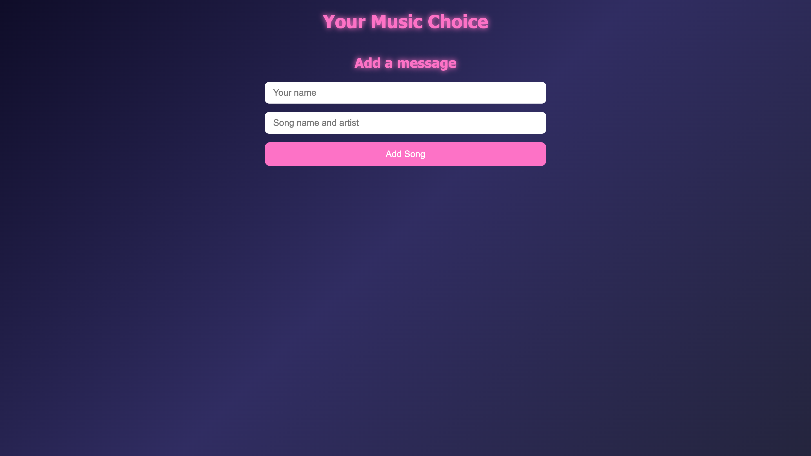

# Music Choice App 🎧

### Description
User can Login/Sign up to make an account to mark down what music artist they are listening to and what the song is. They can also upvote on their songs and delete them as well.

### Tech Used:

- HTML
- CSS
- Javascript
- MongoDB
- Node.js + Express

### Lessons Learned:
- How to manage a database using MongoDB
- How to store data

## Installation

1. Clone repo
2. run `npm install`

## Usage

1. run `node server.js`
2. Navigate to `localhost:3000`

## Credit

Modified from Scotch.io's auth tutorial